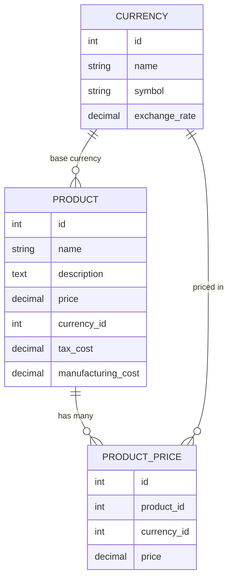

# Descripción del proyecto
    API RESTful desarrollada en Laravel para la gestión de productos y sus precios en múltiples divisas. Permite operaciones CRUD y manejo de conversiones utilizando tasas de cambio almacenadas en base de datos.


# Decisiones técnicas

- Renombré los modelos a inglés para mantener consistencia en el dominio, aunque varios campos permanecen en español.
- Las rutas como `/api/products/{id}` usan Route Model Binding, lo que simplifica el manejo de recursos inexistentes.
- Para mantener consistencia en una API REST, ajusté el manejo global de excepciones para que los errores `404` respondan siempre en JSON, tanto cuando falla el route model binding como cuando la ruta API no existe.
- También hice un ajuste global en `bootstrap/app.php` para que las `ValidationException` respondan siempre en JSON dentro de `/api/*`.
- El campo `price` en `products` se maneja como precio base del producto y `product_prices` almacena los precios equivalentes en otras divisas.

Ejemplo de precio base:

```text
products.price = 1000
products.currency_id = 1 (USD)

product_prices:
- currency_id = 1, price = 1000 (precio base)
- currency_id = 2, price = 950 (EUR)
- currency_id = 3, price = 850 (GBP)
```

- Se valida que no pueda existir más de un precio para la misma moneda en un mismo producto, incluyendo la moneda base.
- Si el producto tiene como moneda base USD, no se permite crear otra relación en `product_prices` con esa misma moneda.

## Decisiones sobre la lógica

- `tax_cost <= price`: el impuesto no puede ser mayor al precio.
- `manufacturing_cost <= price`: el costo de fabricación no puede exceder el precio de venta.
- `price >= 0`: no se permiten precios negativos.
- Campos decimales como `price`, `tax_cost` y `manufacturing_cost` pueden enviarse como strings numéricos en JSON y Laravel los valida correctamente con `numeric`.

# Estructura del proyecto
    project/
    │
    ├── app/
    ├── database/
    ├── routes/api.php
    │
    ├── docs/
    │   ├── postman_collection.json
        tests/

    │
    ├── README.md


## Modelos



# Explicación de las relaciones
    Product → Currency
        Cada producto tiene una divisa base (currency_id).
    Product → ProductPrice
        Cada producto puede tener muchos precios en diferentes divisas.
    ProductPrice → Currency
        Cada precio está asociado a una divisa específica.
    Currency → Product/ProductPrice
        Una divisa puede ser base de muchos productos y usada en muchos precios.

# Cómo correr el proyecto
    composer install
    cp .env.example .env
    php artisan key:generate
    php artisan migrate
    php artisan db:seed #He creado productos de prueba 
    php artisan serve


Notas
• La API fue creada con laravel 12.56
• La API usa Eloquent para interactuar con la base de datos.
• La API debe devolver los datos en formato JSON.
• La API debe tener una documentación clara y concisa.


# Seguridad
    *se uso eloquent y query builder 
    *se validan los inputs 
    *se aplican restricciones de base de datos y relaciones foraneas
    *manejo claro de errores

# Posibles mejoras
    - soft delete
    - laravel sanctum + auth

# DOCUMENTACION

    - para la documentacion se ha añadido swagger al proyecto y se han documentado las rutas
    - ruta base de la API: http://127.0.0.1:8000/api
    - se ha añadido tambien la carpeta /docs con el "export" de Postman
    - archivo Swagger/OpenAPI generado: /docs/openapi.json
    - interfaz Swagger local: http://127.0.0.1:8000/api/documentation#/
    - para regenerarlo: php artisan l5-swagger:generate


    